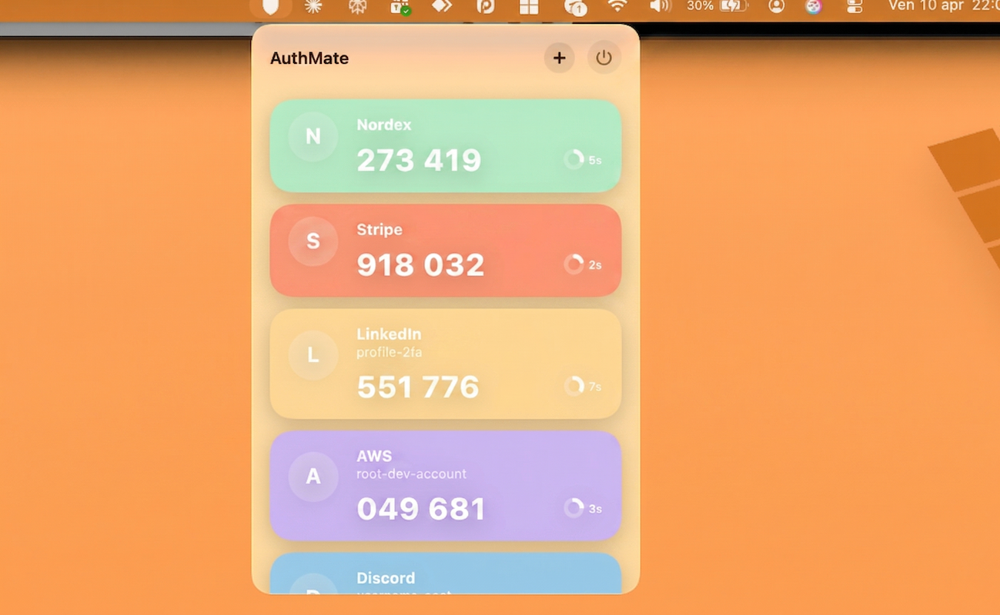

  

  # AuthMate

  🇮🇹 [Italiano](#italiano) · 🇬🇧 [English](#english)

  <picture>
    <source media="(prefers-color-scheme: dark)" srcset="Screenshots/screenshot_dark.png">
    <source media="(prefers-color-scheme: light)" srcset="Screenshots/screenshot_light.png">
    
  </picture>

---

## Italiano

### Funzionalità

- Codici TOTP aggiornati in tempo reale con timer circolare a scadenza
- Copia il codice con un click
- Aggiunta account tramite inserimento manuale, URI `otpauth://` o scansione QR con la fotocamera
- Importazione in blocco da Google Authenticator tramite QR di migrazione (`otpauth-migration://`)
- Interfaccia in italiano o inglese in base alla lingua del sistema operativo

### Sicurezza e Privacy

- **Offline**: nessuna connessione di rete, i codici non lasciano mai il dispositivo.
- **Keychain**: i segreti TOTP (chiavi Base32) sono salvati esclusivamente nel Keychain nativo di macOS — mai su disco o in `UserDefaults`.
- **Sandbox**: l'app è sandboxed; l'unico permesso aggiuntivo richiesto è l'accesso alla fotocamera (opzionale, per la scansione QR).

### Aggiungere un Account

Clicca l'icona nella menu bar, poi il pulsante **+** in alto a destra. Sono disponibili tre modalità:

| Modalità | Quando usarla |
|----------|---------------|
| **Manuale** | Hai nome, issuer e segreto Base32 a portata di mano |
| **URI** | Hai già una stringa `otpauth://totp/...` (es. esportata da un altro gestore) |
| **QR Camera** | Vuoi scansionare un QR code direttamente dallo schermo o da un foglio |

### Importare da Google Authenticator

Google Authenticator esporta gli account tramite un QR speciale (formato `otpauth-migration://`). AuthMate lo supporta nativamente in due modi:

1. **Scansione diretta**: clicca **+** → modalità **QR Camera** → inquadra il QR di esportazione di Google Authenticator. AuthMate importerà tutti gli account presenti nel QR in un colpo solo.
2. **URI testuale**: se hai già decodificato il QR in testo (tramite un'app di scansione generica), clicca **+** → modalità **URI** e incolla la stringa `otpauth-migration://...`.

### Requisiti

- macOS 14 o superiore
- Xcode 15+ (per compilare dal sorgente)

### Installazione

L'app non ha una finestra principale e non appare nel Dock: al lancio comparirà direttamente nella menu bar, vicino all'orologio, con l'icona a scudo.

**Binario precompilato (consigliato):** scarica l'ultima versione dalla sezione [Releases](../../releases) ed esegui direttamente l'app.

**Dal sorgente:**

1. Apri `AuthMate.xcodeproj` in Xcode.
2. Seleziona il tuo team di sviluppo in *Signing & Capabilities*.
3. Premi **⌘R** per compilare ed eseguire.

---

## English

### Features

- Real-time TOTP codes with a circular countdown timer
- One-click copy to clipboard
- Add accounts via manual entry, `otpauth://` URI, or camera QR scan
- Bulk import from Google Authenticator via migration QR (`otpauth-migration://`)
- UI language follows the operating system (Italian or English)

### Security & Privacy

- **Offline**: no network connections; codes never leave your device.
- **Keychain**: TOTP secrets (Base32 keys) are stored exclusively in the native macOS Keychain — never on disk or in `UserDefaults`.
- **Sandboxed**: the only extra entitlement requested is camera access (optional, for QR scanning).

### Adding an Account

Click the menu bar icon, then the **+** button in the top-right corner. Three modes are available:

| Mode | When to use |
|------|-------------|
| **Manual** | You have the account name, issuer, and Base32 secret at hand |
| **URI** | You already have an `otpauth://totp/...` string (e.g. exported from another manager) |
| **QR Camera** | You want to scan a QR code directly from your screen or a printed sheet |

### Importing from Google Authenticator

Google Authenticator exports accounts via a special QR code (in `otpauth-migration://` format). AuthMate supports this natively in two ways:

1. **Direct scan**: tap **+** → **QR Camera** mode → point the camera at Google Authenticator's export QR. AuthMate will import all accounts in one shot.
2. **Text URI**: if you have already decoded the QR into text (using a generic QR scanner app), tap **+** → **URI** mode and paste the `otpauth-migration://...` string.

### Requirements

- macOS 14 or later
- Xcode 15+ (to build from source)

### Installation

The app has no main window and does not appear in the Dock. Once launched, it lives entirely in the menu bar, near the clock, as a shield icon.

**Pre-built binary (recommended):** download the latest release from the [Releases](../../releases) section and run the app directly.

**From source:**

1. Open `AuthMate.xcodeproj` in Xcode.
2. Select your development team under *Signing & Capabilities*.
3. Press **⌘R** to build and run.
